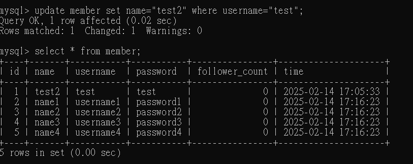
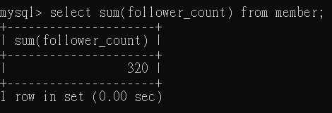
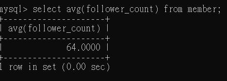
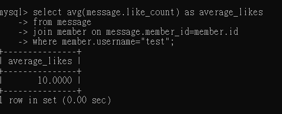
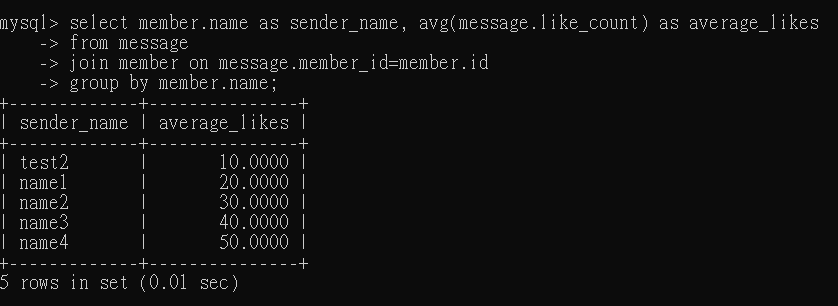

# 第五周作業:
## Task 2:
● Create a new database named website.
    
● Create a new table named member, in the website database
    
    ---------------------------------------------------------------------------------------------------------
## Task 3:
● INSERT a new row to the member table where name, username and password must
be set to test. INSERT additional 4 rows with arbitrary data.
      
● SELECT all rows from the member table
    
● SELECT all rows from the member table, in descending order of time.
    
● SELECT total 3 rows, second to fourth, from the member table, in descending order of time
    
● SELECT rows where username equals to test.
    
● SELECT rows where name includes the es keyword
    
● SELECT rows where both username and password equal to test.
      
● UPDATE data in name column to test2 where username equals to test.
        
    ---------------------------------------------------------------------------------------------------------
## Task 4:
● SELECT how many rows from the member table.
      
● SELECT the sum of follower_count of all the rows from the member table.
    
● SELECT the average of follower_count of all the rows from the member table.
    
● SELECT the average of follower_count of the first 2 rows, in descending order of follower_count, from the member table.
    
    ---------------------------------------------------------------------------------------------------------
## Task 5:
● Create a new table named message, in the website database. designed as below:
     
● 插入測試資料:
    
● SELECT all messages, including sender names. We have to JOIN the member tableto get that.
    
● SELECT all messages, including sender names, where sender username equals to test. We have to JOIN the member table to filter and get that.
    
● Use SELECT, SQL Aggregation Functions with JOIN statement, get the average like count of messages where sender username equals to test.
    
● Use SELECT, SQL Aggregation Functions with JOIN statement, get the average like count of messages GROUP BY sender username.
    